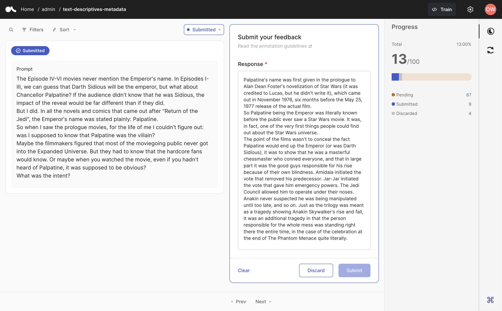

# Annotate a Feedback Dataset



After pushing a `FeedbackDataset` to Argilla, as explained in [Create a Feedback Dataset](create_dataset.ipynb), you can start annotating it through the Argilla UI.

As you open the dataset in the UI, you will see by default the records with `Pending` responses, i.e. records that still don't have a response (annotation), in a single-record view. On the left, you can find the record to annotate and on the right the form with the questions to answer. You can navigate through the records using the `Prev` and `Next` buttons in the bottom bar.

We highly recommend that you read the annotation guidelines before starting the annotation, if there are any. If the guidelines have been specified, you can find them either on the dataset settings page or by clicking the "Read the annotation guidelines" button on the top right of the feedback panel, before starting the annotation.

In the feedback view, you will be able to provide responses/annotations to the given questions. If a question has a description, you will find an info icon next to them; you can click it and you will find useful information about the question itself. Once all required questions have responses, the `Submit` button will be enabled and you will be able to submit your response for the questions of the given record. If either you decide not to provide the responses for a record, you can move to the next record, or you can discard it using the `Discard` button.

To speed up the process, you may use the search bar to filter the records based on specific words or phrases.

```{tip}
If you are having issues with the search engine, you may need to reindex the dataset, as explained [here](../../../getting_started/installation/configurations/database_migrations.md#feedback-datasets).
```

If you need to review your submitted or discarded responses, you can select the queue you need. From there, you can modify, submit or discard responses. You can also use the `Clear` button to remove the response and send the record back to the `Pending` queue.

You can track your progress and the number of `Pending`, `Submitted` and `Discarded` responses by clicking the `Progress` icon in the sidebar.


## Shortcuts

You can speed up the annotation process by using these shortcuts:

```{include} /_common/shortcuts.md
```